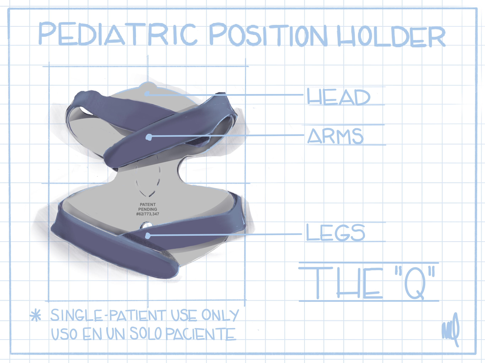

# THE Q PEDIATRIC POSITION HOLDER:
## A Child-Friendly Innovation

**The "Q" Pediatric Position Holder** is an innovative, child-friendly device designed for single-patient use. It is effective, safe, simple, and versatile, providing a standardized method for securely positioning children during medical procedures. Made from 1/2” thick, soft polyurethane foam, it features no extraneous straps, boards, or hook-and-loop attachments, ensuring comfort and ease of use.

Our aim is to reduce the anxiety, fear, and distress that children often experience during medical procedures. The Q Holder is used for short periods in highly monitored settings, offering the unique advantage of **leaving the chest, abdomen, and pelvis free for unrestricted respiration and uninterrupted tube and line placement**.

#### Key Benefits:
- **Child-Friendly Design:** Reduces stress and improves the experience for both children and healthcare providers.
- **Comfort and Safety:** Soft foam construction with no harsh attachments.
- **Effective and Versatile:** Suitable for various medical procedures, ensuring consistent and gentle care.
- **Enhanced Procedure Quality:** Allows for better positioning and access without compromising respiratory or tube placements.

**Most pediatric medical procedures are better performed when the child is motionless**

# HOW PEDIATRIC CARE HAS TRANSFORMED:
## Evolution Over The Years

Medical procedures for children have evolved significantly over the years. In the past, various methods were used to restrain children, often causing distress. **Today, the focus is on gentle, child-friendly techniques**. Let's explore some of the historical methods to appreciate how far pediatric care has come.

Historically, devices like the papoose board and Pigg-O-Stat were used to keep children still during procedures. Manual restraint, where medical staff physically held the child, was also common. These methods, while effective, often resulted in anxiety and fear for young patients. Modern positioning aids, like the Q Pediatric Position Holder, are designed to ensure both security and comfort, making medical procedures less stressful for children and caregivers.

# HOW THE Q POSITIONER TRANSFORMS PEDIATRIC CARE:
## Maximizes Contact, Minimizes Movement

The Q Positioner ensures optimal contact and minimal movement, providing effective stabilization without the need for excessive hands-on intervention. This innovative design allows for sufficient stabilization, ensuring procedures are performed safely and efficiently while maintaining the child's comfort and reducing stress.

|  |  | 
|:--:|:--:|
| One Arm Held (Un Brazo Envuelto) | Two Arms Held (Dos Brazos Envueltos Alrededor) |

|  |  | 
|:--:|:--:|
| Two Arms One Leg - Note the Inner Fold (Dos Brazos Y Una Pierna Envueltos) | Two Arms Both Legs - Outer Fold Surrounds and Secures (Dos Brazos Y Dos Piernas Envueltos) |

## CERTIFIED CHILD LIFE SPECIALISTS (CCLS)
- Child Life Specialists focus on the psychosocial aspect of the child providing coping mechanisms for procedures.
- Coping skills minimize the adverse effects on the child and parent.
- The Q is intended to complement the work of the CCLS.
- The CCLS can incorporate the Q as one of the “comfort kit” tools by using it for medical play.

## RADIATION REDUCTION
**(REDUCCIÓN DE LA RADIACIÓN)**

Reducing radiation exposure is a critical concern in pediatric radiology. The Q Pediatric Position Holder assists with precise positioning for diagnostic X-rays, potentially reducing the number of exposures and thereby minimizing radiation.

**Key Benefits:**
- **Safety for Technologists:** Allows radiologic technologists to maintain a safer distance from primary and scatter radiation.
- **Child-Friendly Design:** Effective, safe, simple, and versatile for single-patient use.
- **Comfort:** Made from 1/2” thick, soft polyurethane foam without extraneous straps or boards, reducing anxiety, fear, and distress.
- **Free Respiration:** Ensures the chest, abdomen, and pelvis remain free for unrestricted breathing and uninterrupted tube and line placement.

The Q Holder is designed for short-term use in highly monitored settings, enhancing both safety and comfort during medical procedures.

## Creators

#### Frank Louis Quattromani, M.D. 
##### Pediatric Radiologist
- University Medical Center, Lubbock, Texas  
- Clinical Professor of Pediatrics and Pathology, Texas Tech University School of Medicine, Lubbock, Texas  
- Former Radiology Consultant to the office of the United States Army Surgeon General  
- U.S. Army Colonel (Medical Department), Retired  

## REFERENCES

1. **Infant Immobilization and Pediatric Papooses: We’ve Come a long Way.** DeBoer, S. et.al. Journal of Emergency Nursing 2007:33:451-5
2. **Comfort Measures for Invasive Procedures: A Major Paradigm Shift in Pediatric Practice.** Mary Barkey, Child Life Council Bulletin, Volume 26, Number 3, 2008
3. **Pediatric Radiation Exposure and Effective Dose Reduction During Voiding Cystourethrography.** Ward, VL et al., Radiology Vol 249, No. 3
4. **Advocating for use of the ALARA principle.** American College of Radiology
5. **A Search for improved technique factors in pediatric fluoroscopy.** Tapiovaara, MJ. et al Physics in Medicine and Biology, Vol 44, Number 2
6. **Safety considerations in immobilizing pediatric clients for radiography procedures.** J Mari Beth Linder. Journal of Radiology Nursing. March 2017, Volume 36, Issue 1. Pages 55-58
7. **Radiation Protection in Pediatrics Imaging.** Bryant Furlow. Radiologic Technology May/June 2011 Vol 82 no. 5 421-439
8. **Managing Patient Stress in Pediatric Radiology.** Melody Alexander July/August 2012 vol. 83 No. 6. 549-560.
9. **Radiation Protection in Pediatric Radiography-Introducing Some Immobilization and Protection Equipment.** Klays, D. Pediatric Today 2016: 12 (1) 81-86
10. **Q&A: Children’s National CEO aims to tailor treatments to his young patients.** Matthew Weinstock. Modern Healthcare. January 11, 2020

#### Patricia Rae Quattromani
##### Co-Inventor and Product Designer
